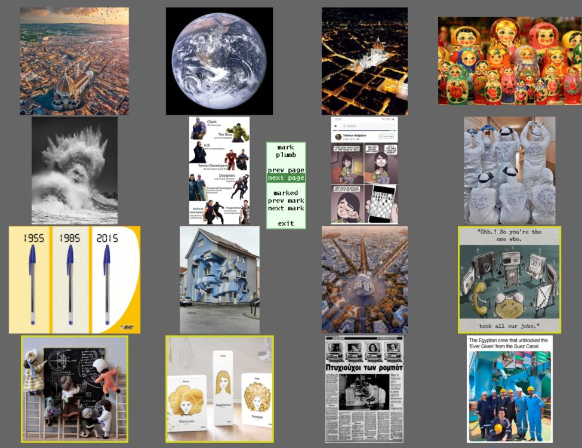
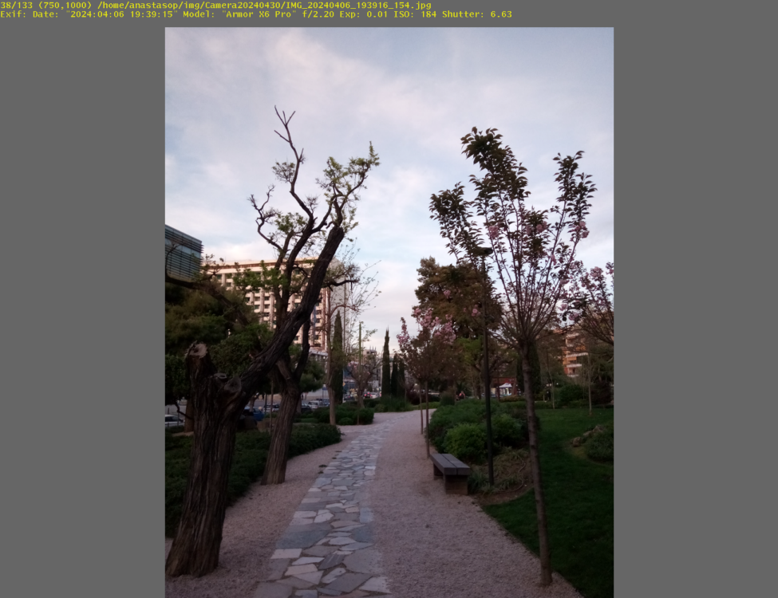
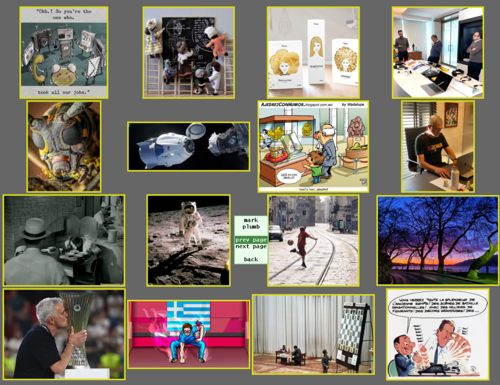

# Iview

Iview is yet another image viewer. It is not a replacement for the popular ones like eog, fim, feh, photos etc, it is just tailored made for me. The functionality i want from an image viewer is currently provided from the combination file manager+image viewer. I wanted something more integrated.

- Just display images, no editing capabilities.
- Quickly browse pages with icons to find the photos you want.
- No visual clutter. No buttons, titles, input forms, other windows etc. Just use the mouse in an intuitive way. This is essential when using a wall projector.
- No scroll bars. Treat marked icons as bookmarks and move around. You don't have to remember if a photo was near the top or just before the middle.
- Work well together with other unix tools. Give input with `find`, view the images and print the paths of the selected ones to be used in another shell pipeline.
- Work well with remote file systems. The image viewers i have used, assume local images. They create thumbnails in _hidden_ directories and assume images will be fetched and decoded fast. This is not the case if the file server runs on a raspberry and is accessed with wifi. This needs aggresive caching and image prefetching.

Enjoy!

## Install

Iview is written in go. You need the go SDK which you can install with your OS package manager or download it from [here](https://go.dev/dl/).

For graphics it uses [plan9port](https://9fans.github.io/plan9port/). The library is very portable and runs on Linux, BSDs, MacOS and Windows WSL. You can install it with your OS package manager or from source from [here](https://github.com/9fans/plan9port).

To install iview, simply
```
go install github.com/anastasop/iview@latest
```

If you just want to try it with docker, use
```
./docker-demo.sh <dir path>
```

This takes some time, as it fetches the go debian image and builds plan9port from source.

## Usage

For starters
```
iview <image dir>
```

It will load images and start with a view of icons, like this:



You can use the mouse for simple actions: left button displays an image, right button marks an image and the middle button (click scroll wheel or ctrl+left button), displays the menu:

- **mark** marks the image, same as right button.
- **plumb** _plumbs_ the image. This is a plan9 term, think it as display with the system viewer.
- **prev page** go to the previous page.
- **next page** go to the next page.
- **marked** display only the marked images.
- **prev mark** go to the immediate previous page with a marked image.
- **next mark** go to the immediate next page with a marked image.
- **exit** exit

The display view presents the full image, scaled to fit window, with some information.



Again you can use the mouse for simple actions: left button displays the previous image, right button displays the next image and middle button displays the menu:

- **info** toggle display of image information.
- **mark** marks the image.
- **plumb** _plumbs_ the image. This is a plan9 term, think it as display with the system viewer.
- **back** go back to the icons view.

Finally the marked view is like the icon view but with a restricted menu:



## License

Licensed under the 3-Clause BSD License.

## BUGS

- use a better algorithm to draw icons view and reduce the gaps between icons. 
- add simple editing like rotations, or zoom.
- maybe extract the cache to a separate process memory only 9p server.
- add support for cbz, useful for reading comics.
